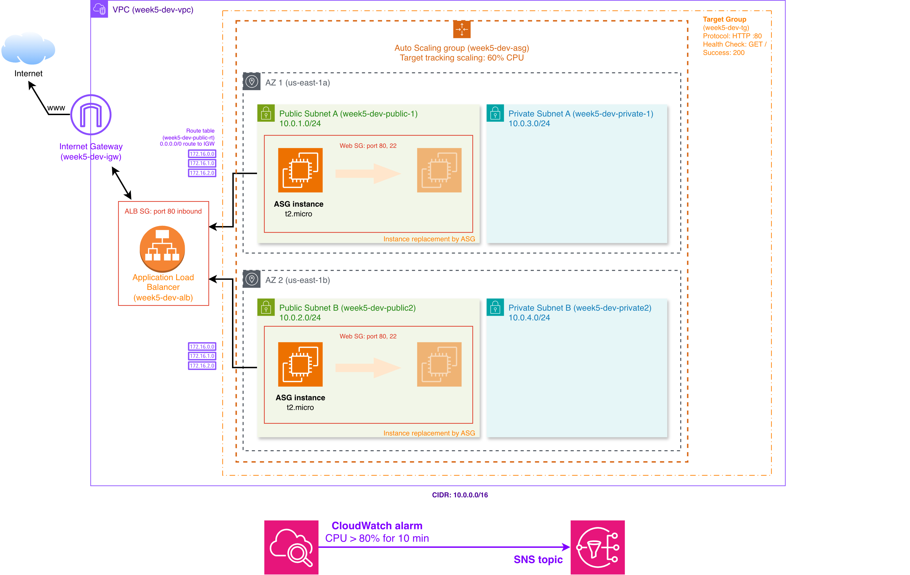

# Week 5 — Terraform Fundamentals + Modules (Autoscaling Web Tier)

> **What this proves:** Can codify a multi-AZ web tier in Terraform with reusable modules, eliminate drift, and deploy or destroy in one command.

Weeks 2-3 proved I could build a VPC and a high-availability web tier by hand. This week I rebuilt the same architecture -- ALB, Auto Scaling Group, CloudWatch alarms -- entirely in Terraform with reusable modules and separate dev/prod environments. One `terraform apply` creates everything. One `terraform destroy` tears it all down.

## Quick demo (video)

LinkedIn article + video: [Terraform deployed my entire AWS architecture in under 5 minutes. Here is why I stopped clicking the Console.](https://www.linkedin.com/pulse/terraform-deployed-my-entire-aws-architecture-under-5-fresco-glife/)

---

**ALB → Target Group → ASG (2 AZs) + CloudWatch alarm → SNS**



---

## Output

- Architecture diagram: [`infra/week5-architecture.png`](./infra/week5-architecture.png)
- Decision log: [`docs/DECISIONS.md`](./docs/DECISIONS.md)
- Terraform source: [`main.tf`](./main.tf), [`modules/`](./modules/)

---

## What I built

| Category | Resource | Details |
| --- | --- | --- |
| Networking | VPC | 2 public + 2 private subnets across multiple AZs |
| Networking | Internet Gateway | Public route table with 0.0.0.0/0 route |
| Compute | Launch Template | Amazon Linux 2023, Apache httpd via user data |
| Compute | Auto Scaling Group | Min/max/desired configurable per environment |
| Compute | Scaling Policy | Target tracking at 60% average CPU |
| Load Balancing | Application Load Balancer | HTTP listener on port 80 |
| Load Balancing | Target Group | Health checks on instance port |
| Security | ALB security group | HTTP inbound from anywhere |
| Security | Web instance security group | HTTP + SSH inbound |
| Monitoring | CloudWatch alarm | CPU > 80% sustained for 10 min |
| Monitoring | SNS topic | Alert notifications |

### Module responsibilities

**`modules/vpc`** — Owns all networking. Creates the VPC, IGW, subnets distributed across dynamically discovered AZs, and the public route table. Private subnets intentionally have no NAT Gateway (cost optimization).

**`modules/security_group`** — Reusable SG with a dynamic `ingress_rules` input. Used twice in root: `module.alb_sg` (HTTP only) and `module.web_sg` (HTTP + SSH).

---

## What I tested

- Running `terraform plan` to verify the dependency graph resolves correctly before any resources exist
- Watching the ASG replace an instance after ELB health checks failed
- Running `terraform destroy` and verifying zero resources remain (no orphaned ENIs, no dangling SGs)

---

## Prerequisites

| Requirement | Version |
| --- | --- |
| [Terraform](https://developer.hashicorp.com/terraform/install) | >= 1.5.0 |
| [AWS CLI](https://docs.aws.amazon.com/cli/latest/userguide/install-cliv2.html) | v2+ |
| AWS credentials configured | `aws configure` or env vars |
| AWS account with EC2/VPC/ELB permissions | — |

---

## Quick Start

```bash
# 1. Clone the repo
git clone <repo-url>
cd week-05-terraform-fundamentals-modules

# 2. Initialize Terraform (downloads AWS provider)
terraform init

# 3. Preview changes for dev
terraform plan -var-file="dev.tfvars"

# 4. Deploy to dev
terraform apply -var-file="dev.tfvars"

# 5. Get the ALB DNS name from outputs
terraform output alb_dns_name

# 6. Verify the web server is running (may take ~2 min for instances to pass health checks)
curl http://$(terraform output -raw alb_dns_name)

# 7. Tear down when done
terraform destroy -var-file="dev.tfvars"
```

> **Note:** `*.tfvars` files are excluded from git. Do not commit them if they contain sensitive values.

---

## Project Structure

```text
week-05-terraform-fundamentals-modules/
├── main.tf                   # Root module: provider, ALB, ASG, scaling, monitoring
├── variables.tf              # Input variables (region, instance type, CIDRs, ASG sizing)
├── outputs.tf                # Outputs: VPC ID, ALB DNS name, ASG name
├── dev.tfvars                # Dev environment values (not committed)
├── prod.tfvars               # Prod environment values (not committed)
├── docs/
│   └── DECISIONS.md          # Architecture decisions and Terraform concepts
├── infra/
│   └── week5-architecture.png  # Architecture diagram
└── modules/
    ├── vpc/
    │   ├── main.tf           # VPC, IGW, subnets, route tables, associations
    │   ├── variables.tf      # name, vpc_cidr, public/private subnet CIDRs
    │   └── outputs.tf        # vpc_id, public_subnet_ids, private_subnet_ids, vpc_cidr_block
    └── security_group/
        ├── main.tf           # Security group with dynamic ingress rules
        ├── variables.tf      # name, description, vpc_id, ingress_rules
        └── outputs.tf        # security_group_id
```

---

## Environment Comparison

| Setting | Dev | Prod |
| --- | --- | --- |
| `project_name` | `week5-dev` | `week5-prod` |
| `aws_region` | `us-east-1` | `us-east-1` |
| `vpc_cidr` | `10.0.0.0/16` | `10.1.0.0/16` |
| `public_subnet_cidrs` | `10.0.1.0/24`, `10.0.2.0/24` | `10.1.1.0/24`, `10.1.2.0/24` |
| `private_subnet_cidrs` | `10.0.3.0/24`, `10.0.4.0/24` | `10.1.3.0/24`, `10.1.4.0/24` |
| `instance_type` | `t2.micro` (free tier) | `t3.medium` |
| `asg_min` | `1` | `2` |
| `asg_max` | `2` | `6` |
| `asg_desired` | `1` | `2` |

> Dev and prod use different VPC CIDRs (`10.0.x.x` vs `10.1.x.x`) so both can coexist in the same AWS account without IP conflicts.

---

## Outputs

After `terraform apply`, the following values are available:

| Output | Description |
| --- | --- |
| `vpc_id` | ID of the created VPC |
| `alb_dns_name` | ALB DNS name — visit `http://<this>` to test |
| `asg_name` | Auto Scaling Group name |

---

## Cost reality (us-east-1)

| Resource | Est. Monthly Cost |
| --- | --- |
| ALB | ~$16 + LCU charges |
| EC2 t2.micro x 1 (free tier eligible) | $0 first 12 months |
| EC2 t2.micro x 2 (beyond free tier) | ~$8.50 each |
| VPC, subnets, IGW, route tables | $0 |
| CloudWatch alarm (1 metric) | ~$0.10 |
| SNS topic | $0 (first 1M requests) |
| **Dev total (with free tier)** | **~$17/month** |
| NAT Gateway (not included) | ~$32/month if added |

> The ALB is the main cost driver. Tear down dev environments when not in use.

---

## Design rationale

1. **Terraform's dependency graph resolves ordering from references.** A subnet referencing `aws_vpc.main.id` tells Terraform the VPC must exist first. File position is irrelevant.
2. **ELB health checks catch what EC2 checks miss.** An instance can be "running" at the hypervisor level while the application process has crashed. `health_check_type = "ELB"` verifies the app actually responds.
3. **Separate security groups per tier enforce least privilege.** The ALB accepts public traffic, but instances only accept traffic from the ALB. A shared SG would expose instances directly to the internet.
4. **Non-overlapping VPC CIDRs between environments enable future peering.** If dev and prod both used `10.0.0.0/16`, you could never connect them or route between them unambiguously.
5. **Modules eliminate duplication and drift.** One VPC module serves every environment. Change it once, and every `terraform apply` picks up the update instead of editing N copies.

---

## Production Improvements

Changes needed before running real workloads:

- **NAT Gateway** — lets private-subnet instances reach the internet for package updates without being publicly exposed (~$32/month).
- **HTTPS (ACM + ALB listener rule)** — encrypts traffic in transit; required for any user-facing service. Terminate TLS at the ALB with a free ACM certificate.
- **Private subnets for instances** — move ASG instances out of public subnets so they have no public IPs. All traffic should flow exclusively through the ALB.
- **Remote state (S3 + DynamoDB)** — local `.tfstate` files cannot be shared or locked. Teams need a centralized backend with state locking to prevent concurrent writes.
- **WAF** — attach AWS WAF to the ALB to protect against OWASP top 10 attacks (SQLi, XSS, bot traffic).
- **Bastion-only SSH** — replace the `0.0.0.0/0` SSH rule with a bastion host in a public subnet, or eliminate SSH entirely using SSM Session Manager.
